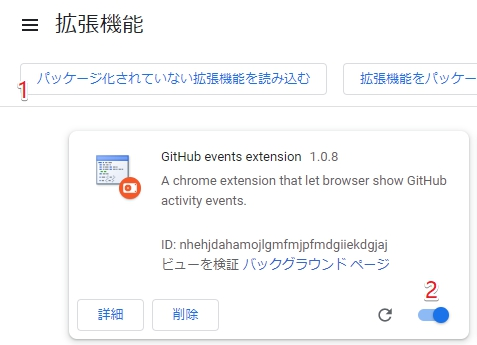

# GithubEventsExt

+ A Chrome extension that shows GitHub activity events in sidebar and improves several UI details.
+ For Userscript version, please visit [Aoi-hosizora/GithubEventsExt_Userscript](https://github.com/Aoi-hosizora/GithubEventsExt_Userscript).

### Features

+ [x] Show repo, user and org events in human readable format in sidebar.
+ [x] Improve several GitHub UI details.

### Install

1. Clone the built source code by `git clone --single-branch --branch dist https://github.com/Aoi-hosizora/GithubEventsExt`.
2. Open Chrome Extension setting in `chrome://extensions/`, click the "Load unpacked" button and select the cloned folder.
3. Click the switcher of "GitHub events extension" to enable it. Now you will see the effect after refresh the GitHub page.

### Screenshots

### License

+ GithubEventsExt is a free and open-source software, and is released under the **MIT License**.
+ Copyright (c) 2020-2023 [AoiHosizora (青いほしぞら)](https://github.com/Aoi-hosizora). Visit [LICENSE](./LICENSE) for details.

### Acknowledgements

+ GithubEventsExt is supported by [JetBrains Free License Programs](https://www.jetbrains.com/community/opensource/#support). [JetBrains](https://www.jetbrains.com/) provides us a free open-source development license for this open-source project.

### References

+ [activity events types](https://developer.github.com/v3/activity/events/types/)
+ [Manifest V2 Getting started](https://developer.chrome.com/docs/extensions/mv2/getstarted/)
+ [chrome-plugin-demo](https://github.com/sxei/chrome-plugin-demo)
+ [github-repo-size](https://github.com/harshjv/github-repo-size)
+ [chrome拡張をTypeScriptで開発するときのWebpackの設定](https://qiita.com/okumurakengo/items/1a4404c20b0bf10f2c68)
+ [JQueryUI resizable](https://jqueryui.com/resizable/)
+ [The Right Usage of Aliases in Webpack and TypeScript](https://betterprogramming.pub/the-right-usage-of-aliases-in-webpack-typescript-4418327f47fa)
