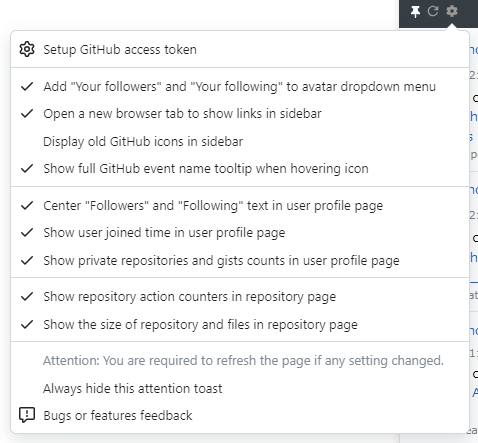

# GithubEventsExt

+ A chrome extension that let browser show GitHub activity events.
+ For Userscript (Tampermonkey) version, please visit [Aoi-hosizora/GithubEventsExt_Userscript](https://github.com/Aoi-hosizora/GithubEventsExt_Userscript).

### Functions

+ [x] Show repo, user and org events in human readable format.
+ [x] Improve several GitHub UI details.

### Install

1. Clone the built source code by `git clone --single-branch --branch dist https://github.com/Aoi-hosizora/GithubEventsExt`.
2. Open Chrome Extension setting in `chrome://extensions/`, click the "Load unpacked" button and select the cloned folder.
3. Click the switcher of "GitHub events extension" to enable it. Now you will see the effect after refresh the GitHub page.

### Screenshot

### References

+ [activity events types](https://developer.github.com/v3/activity/events/types/)
+ [chrome-plugin-demo](https://github.com/sxei/chrome-plugin-demo)
+ [github-repo-size](https://github.com/harshjv/github-repo-size)
+ [chrome拡張をTypeScriptで開発するときのWebpackの設定](https://qiita.com/okumurakengo/items/1a4404c20b0bf10f2c68)
+ [JQueryUI resizable](https://jqueryui.com/resizable/)
