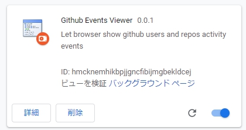
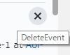
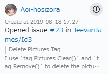
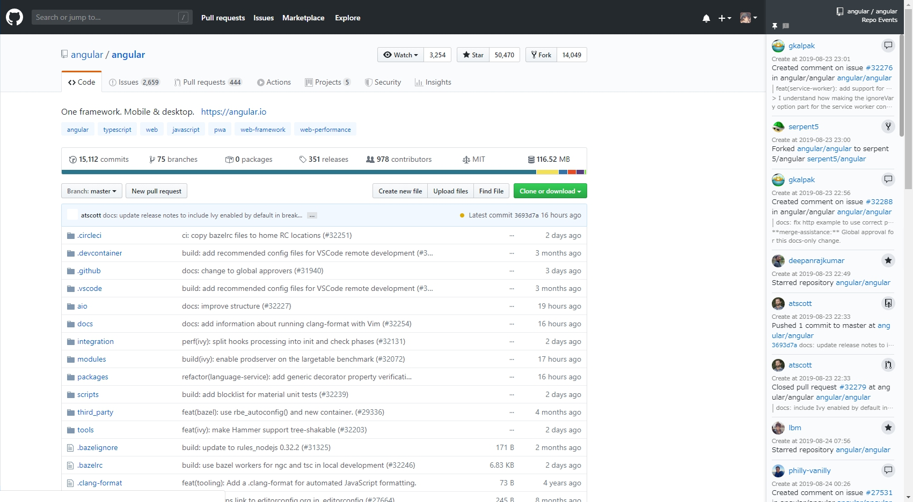
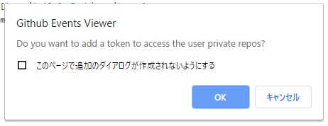

# GithubEvents_ChromeExt
+ Let browser show github users and repos activity events
+ Use [Github API V3](https://developer.github.com/v3/) to build this extension

### Environment
+ `Chrome 76.0.3809.100`

### Functions
+ [x] Show Repo Events
+ [x] Show User Events
+ [x] Show different title and url of different events
+ [x] Set token to access user private repos
+ [ ] Error reminder
+ [ ] ...

### How to run
+ git clone the whole repo
+ Open Chrome Extension setting [chrome://extensions/](chrome://extensions/)
+ Click `Load unpacked` to open the repo folder
+ (too poor to be a chrome developer)

### Events
+ Support Event: 
    + `PushEvent` `CreateEvent` `WatchEvent` `IssuesEvent` `IssueCommentEvent` `ForkEvent` `PullRequestEvent`
    + `MemberEvent` `PullRequestReviewCommentEvent` `CommitCommentEvent` `ReleaseEvent` `DeleteEvent` `PublicEvent`
+ If there is an unknown event, please open an issue.
+ (Event type will be shown when the cursor is hovering over the event icon)

### Tips
+ All element classNames start with `.ah-`
+ All element ids start with `#ahid-`
+ Setup user token
    + visit https://github.com/settings/tokens to get token
    + click the ext icon to set or remove token
+ Display

> Content showing in the reference blank is for: ( `.ah-ipr-title` )
> + issue title
> + pull request title
> + release title
>
> Content showing in the sub title is for: ( `.ah-ipr-body` )
> + issue & issue comment body
> + pull request & pull request review comment body
> + commit comment body
> + release body
>
> ( Detail code see the function `parseApiJson()` in [core.js](https://github.com/Aoi-hosizora/GithubEvents_ChromeExt/blob/master/src/js/core.js#L253) )
>
> 

### Screenshot

### Problems
+ Resize is too slow
+ Could not distinguish user event and org event
+ ...

### References
+ [activity events types](https://developer.github.com/v3/activity/events/types/)
+ [chrome-plugin-demo](https://github.com/sxei/chrome-plugin-demo)
+ [github-repo-size](https://github.com/harshjv/github-repo-size)